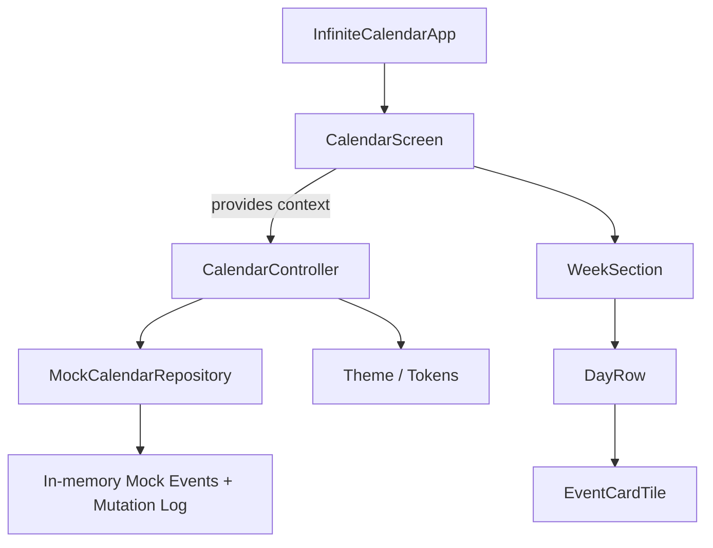
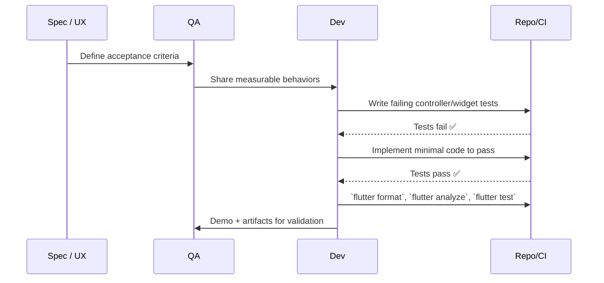
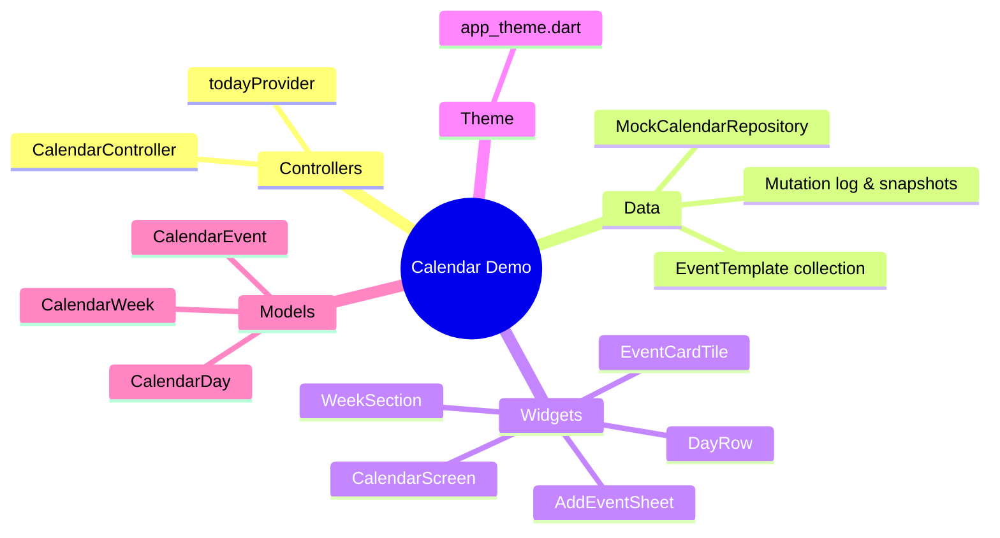

# AGENTS Playbook

Guidance for agents and contributors building on the Infinite Scroll Event Calendar demo. This document covers workflow expectations, TDD strategy, architecture touchpoints, and code quality standards for Dart, Flutter, and Git.

## 1. System Overview

- `InfiniteCalendarApp` wires theming and the root route.
- `CalendarScreen` hosts the sliver scroll view and dispatches user intents.
- `CalendarController` (Riverpod Notifier) owns weeks, days, drag sessions, and mutations.
- `MockCalendarRepository` emits deterministic fake events that stand in for meals, workouts, or any future data source.

## 2. TDD Workflow

**Always start with tests.** For new behavior: create/extend controller tests, then widget/integration tests as needed. No code merges without a green test suite and lint-free analysis.

## 3. Test Matrix

| Layer          | Tooling         | Focus                                                                 |
|----------------|-----------------|------------------------------------------------------------------------|
| Controller     | `flutter test`  | Infinite paging, add/move/remove logic, undo semantics.               |
| Widget         | `flutter test`  | Rendering of week headers, add panel, empty states, interactions.     |
| Integration*   | `flutter drive` | Scroll momentum, drag haptics, device theming (optional when needed). |

*
Integration runs are optional for this demo but recommended before shipping to production apps.

## 4. Dart & Flutter Best Practices

- Prefer `const` constructors and widgets whenever possible to reduce rebuilds.
- Keep UI concerns in widgets; move mutations and state orchestration into controllers/notifiers.
- Use `Theme.of(context)` and `ColorScheme` values rather than hard-coded colors.
- Design widgets to accept callbacks/data (`title`, `quantity`, `color`, `icon`) so they remain reusable across domains.
- Guard all async UI work with `if (!context.mounted)` or by capturing `ScaffoldMessenger` before `await`.
- Replace deprecated APIs promptly (e.g., `withValues` instead of `withOpacity`, `onAcceptWithDetails` for drag targets).
- Run `flutter analyze` and `dart format` before every commit; CI should block on warnings.

## 5. Git Discipline

- Branch naming: `feature/<short-desc>` or `fix/<short-desc>`.
- Commit format: imperative mood, scoped (e.g., `Add drag target highlighting`).
- One logical unit per commit: implement test + code together so history stays bisectable.
- Rebase over merge for clean history; resolve conflicts locally with tests rerun afterwards.
- Never force-push to `main`; use PRs and require reviews when collaborating.

## 6. Module Responsibilities

- **Controllers**: Pure Dart logic, no direct widget dependencies. Fully testable without Flutter bindings.
- **Data**: Supplies in-memory fixtures plus an idempotent event log for add/move/delete, ready to swap with real persistence layers.
- **Widgets**: Stateless where possible; stateful wrappers used only for scroll controllers or sheet coordination.
- **Theme**: Houses design tokens so downstream apps can override styles centrally.
- **Models**: Lightweight value objects for calendar entities.

## 7. Working Agreements

- The demo intentionally stores everything in memory. Do not add persistence unless explicitly requested.
- Keep terminology generic—cards are “entries” with `title` and `quantity`, never assume specific domains.
- When adding new features, update tests *and* documentation (README + this playbook) in the same PR.
- Validate on both iOS and Android simulators before sign-off; platform nuances (bounce vs clamping) must remain intact.

## 8. Release Checklist

1. `flutter format lib test`
2. `flutter analyze`
3. `flutter test`
4. Manual run on at least one iOS simulator and one Android emulator
5. Update README/AGENTS if behavior or architecture changes
6. Tag commit or open PR for review

## 9. Bake-off Demo Guidelines

For the bake-off, each demo implementation must reside in a unique subfolder directly under the `./demo` directory. Each of these subfolders must contain its own `README.md` file with the following information:

1.  The specific calendar component, library, or tool used for the implementation.
2.  Any features or aspects of the `SPEC.md` that were not possible to implement, along with a brief explanation.